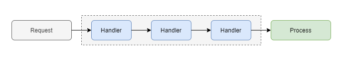

# Franey Behavior Patern Unit Library Framework 1.0


### * List of libraries included *
### Franey.BPUL.NET (Franey Behavior Pattern Unit Library) 
### Franey.BehaviorPatternStrat.NET (Behavior Pattern Strategies, Factories, and Unit Services)
### Franey.DynamicPatternInjector.NET (Behavior Pattern Library IOC Injector )


### This Frameowke allows .Net Core developers to Apply Behavior patterns of
###  Chain or Responsibility (COR) or my Concurrent Responsiblity Pattern (CRP).
### 
### using the Strategy Execute Pattern and an internal Factory Pattern to allow 
###  lazy injection of actual service (unit of work class).
###
### This systm also forces the use of default factories to avoid unmanaged logic in chain or CRP


### This framework is design for easy DI registraton using .NET Dependency Injection Framework, 
###   which allows all patterns to follow same lifetime and Packet (request record).


## You can now apply old school behavior pattern using the latest SOLID 
##     and DI designs of current development practices. 
## Note: SOLID and Microservice style practices still matter , and do not allow the chain to be large 
##     nor allow serial API calls that is an anti-pattern.

# 4 strategies:
<pre>


*   Single COR (most common) => First one to pass.
*   Partial Full COR (least common) => One or Many passes to update reponse.
*   Full COR (Decorator Pattern) (new) => All must pass in chain or fails with default.
*   Single CPR (New) => Any one that passes concurrently but hghest priority wins .
*   Standard CPR (New) => Any one that passes concurrently , handled by locking & priority updates.
*   Full CPR (New) => All must passes concurrently , handled by locking and
       udating in order of priority (Best for multiple API and Domain DB calls).

</pre>


# Example Business Logic:

<pre>
 Example use: Full Decorator (or at best Full CPR): (all must pass) , 
              In specialized Orchestrated API (if lack of CQRS or message broker):
              Purchase System -> (validate Request) => Inventory check =>   Check payment or funds => 
              Process Pyment => handle Default issues 
</pre>


<pre>
 Example use: Classic Single Chain (or Single CPR?): (first must pass) In API, 
                  Validate loan approval based on Amount & Role of Approval

              Loan Approval -> (main service - not in strategy)  Request (validate request) 
                                    and create approval request record => 
                                Check General approval (Rule: < $500 and approved) => 
                                Supervisor Approval (Rule: < $5000 and approved) => 
                                Manager Approval  (Rule: approved and >= $5000) =>
                                Default Point: (No approval ) send not approved response               
</pre>


<pre>
 Example use: Partial Full Chain (Not good for CPR) : (any or few must pass) In API,
				      Validate loan approval based on Amount & Role of Approval
              Loan Approval -> (main service - not in strategy)  Request (validate request) & create approval  => 
                                Check General approval (Rule: < $500 and approved) => 
                                Supervisor Approval (Rule: < $5000 and approved and last chain passed) => 
                                Manager Approval  (Rule: approved and >= $5000 by itself) => 
                                Default Point: (no/partial approval ) send not approved response  
</pre>


  
# Chain Of Responsibility Pattern
Behavioral Design Pattern in C#
 



## General Diagram


## The code sample using this pattern

Here the code sample using this pattern, with the help of factory pattern with strategy.
This utilizes .net 9 dependency injection Ioc Framework.


```cs
// Setup Chain of Responsibility Ioc in console testing example 

   return Host.CreateDefaultBuilder(args)
       .ConfigureAppConfiguration((hostingContext, config) => { config.AddCommandLine(args); })
       .ConfigureServices((_, services) =>
       {
           var appConfig = configurationRoot.GetSection(nameof(AppConfig)).Get<AppConfig>();
           Console.WriteLine($"Environment: {appConfig?.Environment ?? "Local"}");
           services.AddLogging(logging =>
           {
               logging.AddConfiguration(configurationRoot.GetSection("Logging"));
               logging.AddSimpleConsole(options => options.IncludeScopes = true);
           });


   RegisterStrategyWithColorChainFactoriesAsTransient(services);

  public static void RegisterStrategyWithColorChainFactoriesAsSingletonAsync(IServiceCollection services)
  {
  services.AddStrategyAsSingleton<ColorAnalizerCorService.ColorPacket, SingleColorStrategyProvider, NoSingleColorFactory>()
      .AddAnotherStrategy<AllStrategyProvider, NotAllColorsFactory>()
      .ThenToUnitOfWork<RedUnitService, RedColorFactory>()
      .ThenToUnitOfWork<BlueUnitService, BlueColorFactory>()
      .ThenToUnitOfWork<GreenUnitService, GreenColorFactory>()
      .ThenToUnitOfWork<HotUnitService, HotColorFactory>()
      .ThenToUnitOfWork<CoolUnitService, CoolColorFactory>();
  }
 

// Inject AllStrategyProvider into parameter of controller or service calling the strategy

//or in console:
  using var allstrategy = hostProvider.GetRequiredService<AllStrategyProvider>();

// Requests

  strategy.ExecuteStrategy(new ColorPacket
                { Code = "A", Name = "Blue", Temperature = "Cool" });
  var resp = (ColorResponse?)newMessage.Response;

 strategy.ExecuteStrategy(new ColorPacket
                { Code = "B", Name = "Red", Temperature = "Hot" });
  var resp = (ColorResponse?)newMessage.Response;

 strategy.ExecuteStrategy(new ColorPacket
                { Code = "C", Name = "Yellow", Temperature = "Warm" });
  var resp = (ColorResponse?)newMessage.Response;
```
